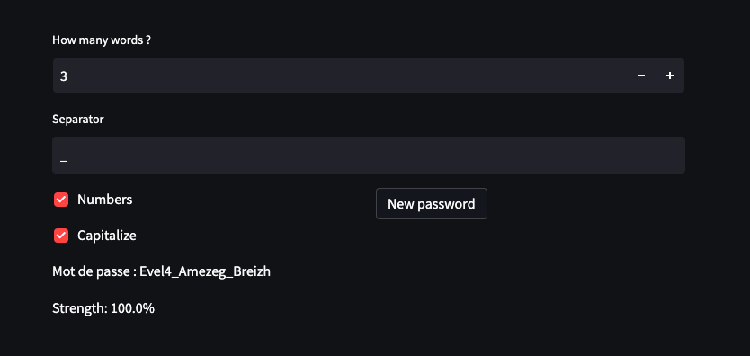

# Breton-Password-Generator
[](https://github.com/Efrei-Paul/Breton-Password-Generator/actions/workflows/github-action-add-dockerhub.yml)

Générateur de mot de passe breton.



## Utilisation
- Image sur [DockerHub](https://hub.docker.com/repository/docker/efreipaul/breton_password_generator).
- Script python ```$ python3 -m streamlit run web/web.py```
